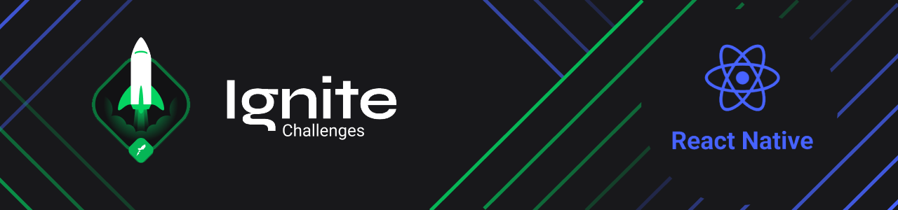

 

  <a href="#About">About & Projects</a>&nbsp;&nbsp;&nbsp;|&nbsp;&nbsp;&nbsp;
  <a href="#Developer">Developer</a>

## :bookmark_tabs: About

The Ignite is a career acceleration program promoted by Rocketseat, and, in this repository, there are some branches, each one is an application developed for the Ignite challenges, durind the React Native track, since the first chapter.

### Projects

|   Chapter   | Project         | Branch     |
| :---------: | :-------------- | :--------- |
|  Chapter I  | To.do           | [todo](https://github.com/MariaGabrielaReis/ignite-challenges/tree/todo) |
| Chapter II  | Comming soon... | --         |
| Chapter III | Comming soon... | --         |
| Chapter IV  | Comming soon... | --         |
|  Chapter V  | Comming soon... | --         |
| Chapter VI  | Comming soon... | --         |

    
## :computer: Developer

:sparkles: Maria Gabriela Reis, 2021   
&nbsp;
&nbsp;

